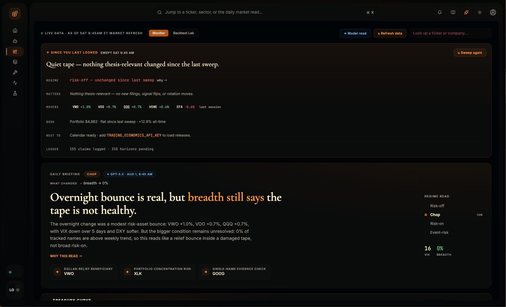
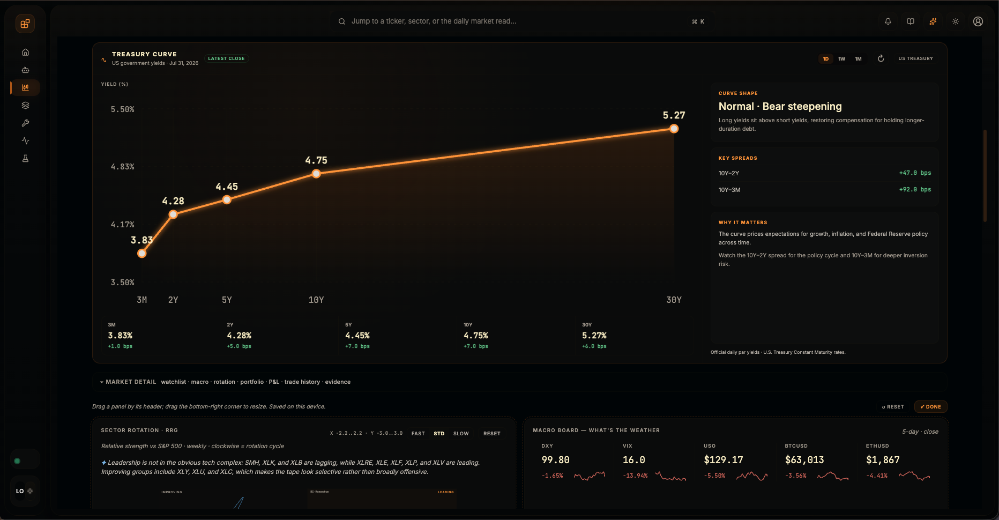
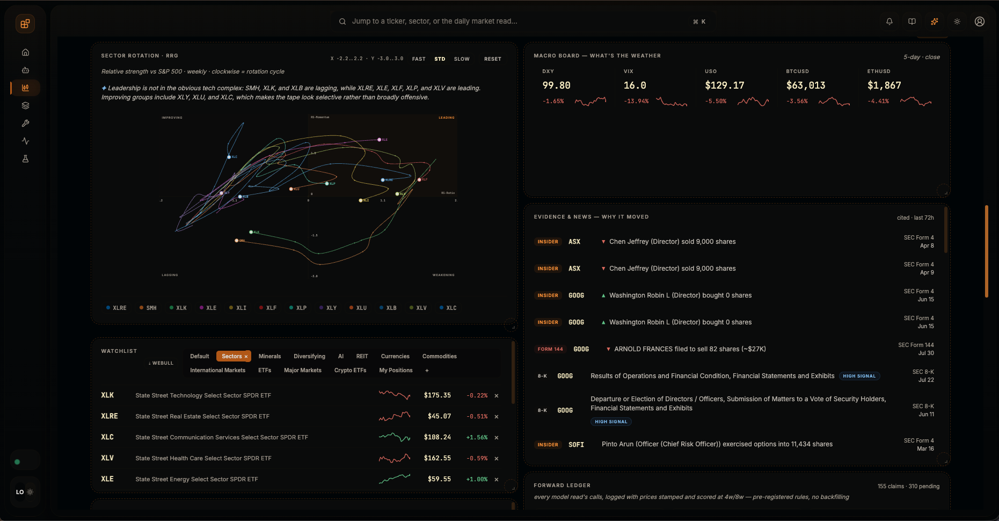

# Pat

I build stuff for fun and bring ideas I have to life. :D

Right now I'm focused on [CopeNet](https://github.com/pattty847/CopeNet): an agent operator studio for running frontier and CLI-backed models in a workspace that I use everyday. You can inspect what they actually do, and turn useful sessions into repeatable workflows. 

## Main Projects

- [CopeNet](https://github.com/pattty847/CopeNet)  
  My main focus right now. A local-first agent harness and operator workspace with persistent sessions, tool calling, runtime inspection, provider and model comparisons, and support for runtimes like LM Studio, Ollama, and Codex CLI.

  It started local-only — small on-device models, no cloud dependency. That fell apart fast: small local models can't reliably plan multi-step tool use or hold an operator workflow together. So CopeNet grew a CLI- and subscription-backed provider layer (`codex-cli`, `claude-cli`, `openai-codex`) on top of the local runtimes. Frontier models do the actual reasoning now; local-first is still the default posture for where sessions, transcripts, and control live.

  

    
  

  
Market Monitor — a 60-second daily brief backed by live SEC filings and a self-scoring forward ledger

  

  
More Market Monitor — treasury curve, sector rotation, evidence feed

  

    
      
    
  

  

  **What's in it:**

  - **Agents Console** — persistent sessions with an inline runtime inspector, first-send provider/profile lock, tool chips attached per turn, and export/copy modes that separate the conversation from tool receipts.
  - **Fleet Rooms** — a durable multi-model room where ChatGPT and Claude answer the same prompt independently behind a reveal barrier, then critique each other's claims in attributed follow-ups instead of just agreeing with each other.
  - **Market Monitor** — a daily model-generated brief on your watchlist: live SEC filings (Form 4, Form 144, 8-K), sector rotation (RRG), an accumulation watch, financial-series overlays (revenue/P/E over split-adjusted price), and the U.S. Treasury curve. Every call the model makes is pre-registered to a forward ledger and scored later — no backfilling the read after the fact.
  - **Access & Permissions** — a trust axis separate from behavior: Read-only, Ask (pauses for approval off an allowlist), or Full Access, gated to trusted frontier providers, with inline approve/reject/always-allow cards on desktop and mobile.
  - **Observability** — run pulse, recent traces, provider/tool distribution, and per-session activity, so a run stays inspectable instead of turning into opaque chat history.
  - **Persona Home** — editable identity per model (`SOUL.md`, `IDENTITY.md`, `USER.md`), including having a model author its own persona on request.
  - **Experiments** — provider × model comparisons in one place for speed, tool behavior, and prompt-following drift.
  - **Mobile-friendly remote access** over Tailscale, token-gated beyond localhost.

- [Sentinel](https://github.com/pattty847/Sentinel-Trading-Terminal)  
  A C++20 + Qt6 trading terminal built for market microstructure. GPU-accelerated order book heatmap, high-performance charting, and a more serious trading interface than what I could comfortably build in Python.

## Selected Work

- [Trade-Suite-v2](https://github.com/pattty847/Trade-Suite-v2)  
  A rebuilt version of my trading workstation, recently revamped with PySide. Scanners, filings, market tooling, and the foundation for a lot of the ideas I still care about.

- [Trade-Suite](https://github.com/pattty847/Trade-Suite)  
  The earlier version that started the whole trading-terminal path.

- [Crypto-Market-Watch](https://github.com/pattty847/Crypto-Market-Watch)  
  Crypto market monitoring and whale and CVD-focused tooling.

## What I'm Into

- local-first AI systems
- agent workflows and tool calling
- observability for model runtimes
- trading terminals and market microstructure
- building software that feels fast, inspectable, and real

## Activity

  
  

